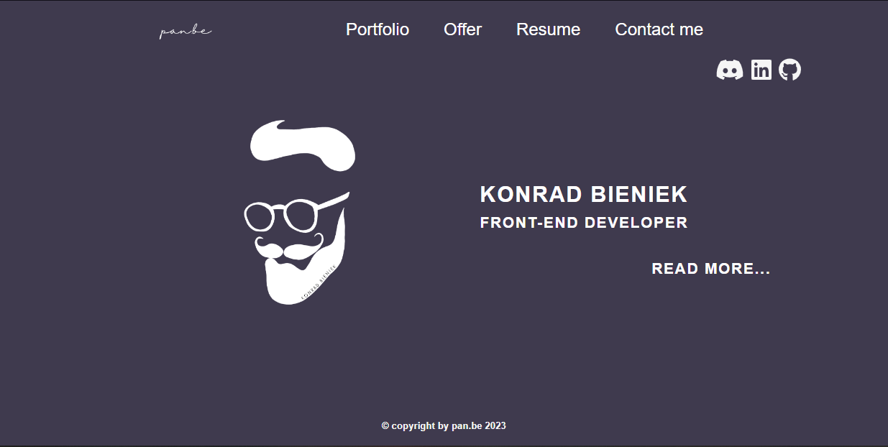

# Pan.be - Personal Landing Page

This is a personal landing page built with React and Next.js. The project is a work in progress, and more features and functionalities will be added in the future. Currently, the page features routing and CSS styling with modules.

## Features

- Routing using Next.js
- CSS styling with modular CSS
- Nodemailer integration for contact form functionality
- React Burger Menu for mobile hamburger menu view
- MongoDB integration as database for projects
- Font Awesome for implementation of social media icons

## Roadmap

- Add a portfolio section to showcase my web development services
- Further enhance the design and user experience of the page
- Add more features to the page to make it a full-fledged personal website

## Getting Started

To run the project locally, clone the repository and run the following commands in your terminal:

npm install
npm run dev

The project will run on `http://localhost:3000`.

## Built With

- [React](https://reactjs.org/)
- [Next.js](https://nextjs.org/)
- [Nodemailer](https://nodemailer.com/about/)
- [React Burger Menu](https://github.com/negomi/react-burger-menu)
- [MongoDB](https://www.mongodb.com/)
- [Font Awesome](https://fontawesome.com/)

## Author

pan.be
